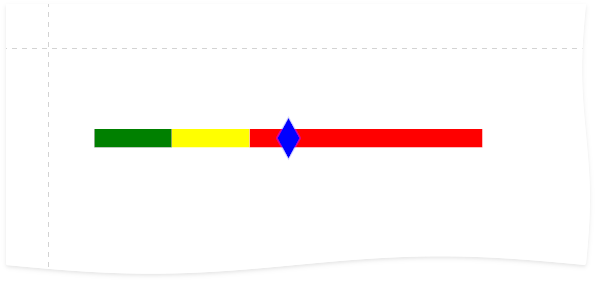
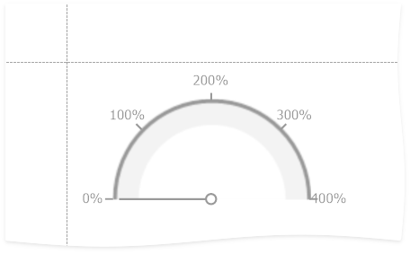

<!-- default badges list -->

[](https://supportcenter.devexpress.com/ticket/details/T951947)
[](https://docs.devexpress.com/GeneralInformation/403183)
<!-- default badges end -->
# Reporting for WPF - Advanced Gauge Customization

The example shows how to customize the `XRGauge` control to create a progress bar.



In the Report Designer, you can set up the basic [`XRGauge`](https://docs.devexpress.com/XtraReports/DevExpress.XtraReports.UI.XRGauge) settings: view, style, theme, actual and target values, minimum and maximum values. For advanced customization, you can use the `XRGauge`'s
`Gauge` property that gives you access to the `XRGauge`'s internal model. The following example demonstrates how to use the `Gauge` property
to create a gauge with formatted values:

```
XRGauge gaugeControl = new XRGauge();
IDashboardGauge gauge = gaugeControl.Gauge;
gauge.Scale.MajorTickmark.FormatString = "{0}%";
```



The example in this repository shows how to customize the `XRGauge` control to create a progress bar:

1. Create a linear gauge:

    ```
    XRGauge gauge = new XRGauge() {
        ViewType = DashboardGaugeType.Linear,
        ViewStyle = DashboardGaugeStyle.Full,
        SizeF = new SizeF(500, 200)
    };
    ```
2. Customize the gauge's elements:

    ```
    IDashboardGauge gaugeControl = gauge.Gauge;
    var gaugeElements = gaugeControl.Elements;

    LinearScale linearScale = GetOrAdd<LinearScale>(gaugeElements);
    SetupLinearScale(linearScale);

    LinearScaleRangeBar rangeBar = GetOrAdd<LinearScaleRangeBar>(gaugeElements);
    SetupRangeBar(rangeBar);

    AddMarker(gaugeControl as DashboardGauge, 50f);
    ```

## Files to Review

* [MainWindow.xaml.cs](CS/MainWindow.xaml.cs) ([MainWindow.xaml.vb](VB/MainWindow.xaml.vb))

## Documentation

- [Visual Elements](https://docs.devexpress.com/WindowsForms/18208/controls-and-libraries/gauges/concepts/visual-elements)
- [Customize Gauges At Runtime](https://docs.devexpress.com/WindowsForms/18249/controls-and-libraries/gauges/examples#at-runtime).
